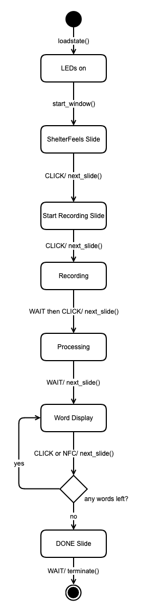

# ShelterFeels

ShelterFeels is a project involving Rapsberry Pi. The code here pertains to a specific object that can perform voice recognition and NFC tag reading. It has a simple gui user interface and, as feedback, controls neopixel LEDs.

The project was created by students as part of a collaboration between Freie Universität Berlin and Kunsthochschule Berlin-Weißensee.

In emotriowheel you will find basic first attempts involving an Arduino.
The shelterfeels directory contains the actual meat of project.

## Installation and execution
Installation will be difficult, because the code is closely connected to the physical object we build. That said, if you're willing to overcome a lot of hardware problems, we advice you to read and understand the code thoroughly before doing anything with it.

You need **python3.10** and the requirements listed in requirements.txt (which is yet incomplete). Doing `pip install -r requirments.txt` will get you there some of the way, but you are likely going to need some extra work to get some packages working.

To run, simply execute run.py with python as sudo: `sudo python run.py`

## Components

### Hardware
- 2.8inch HDMI LCD (H) (SKU: 21316)
- Raspberry Pi 4 Model B (4GB RAM)
- PN532 NFC NXP RFID-Modul (supports I2C)
- iGOKU USB Mikrofon
- Neopixel LEDs

### Recognition app

Found in the voice_recognition_app directory.

You should have FFMPEG installed on your PC to work with audio files. https://ffmpeg.org/download.html
We can use text summarization (creates longer texts) or keywords extraction which is more fitting.
If your mic has more than 2 channels, audio is written only from first two. If you gave mono mic, channels are duplicated.

There's an option to do the processing on a server with inference_remote. If you're using a Raspberry Pi, this is recommended, as processing can take a long time.

In the config of the voice_recognition_app directory, you can change the url of the remote target to process the content. You may also user different AI models or languages. Chances are you also need to specify some things about your audio device.

### GUI

Found in the gui directory.

Tkinter needs to be installed extra with something like `sudo apt-get install python3-tk`.
The GUI is conceptualized as an object that shows different slide. Each slide gets its own bit of code.

In style.py in the gui directory you can switch around some styling options, such as window size,background color and font.

### NFC

Found in the nfc_led directory.

We use the library pn532 to read out NFCs. They return a unique list of numbers. The numbers themselves are unimportant, but the fact they are unique lets know which NFC chip was read. As part of ShelterFeels, we used a set of chips and gave each one meaning, associating it with one of 6 core emotions. So reading a chip gives one of 6 emotions as a return value.

### LED

Found in the nfc_led directory.

The LEDs are categorized by our 6 core emotion, each of which gets assigned an RGB color. For ShelterFeels we used 7 rings of neopixel LEDs and every day of the week was assigned one ring. The code looks up the current date and updates the rings life. Multiple calls will dynamically divide a ring into sections, so if you make the first call, the ring might be all red; a second all can turn the ring half red and half blue, a third call might result in a ring of 1 third red, 1 third blue and 1 third green and so on.

The config in this directory mostly pertains to the LEDs and NFCs you're using. The NFC chips have unique IDs which need to be assigned an emotion. The LEDs can have different adresses or a variable amount, also specified in the config. The code assumes that all LEDs are chaned together.

## Workflow

`run.py` reloads the last state the LEDs were in and then builds the window. Everything afterwards is centrally controlled by a function of window called next_slide. Evry slide has its own setup and functions.

Below, you will find a state chart of how it works.

